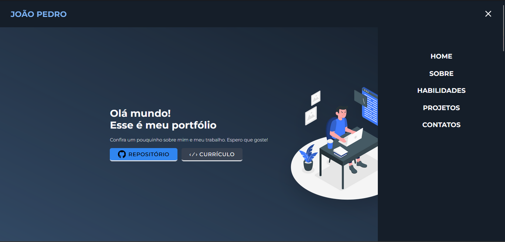

# README

Portfólio feito por [João Pedro Monção](https://github.com/jpmoncao), com React e Tailwind CSS. Tendo abas inicial, contatos, sobre, habilidades e projetos.

##

  <h1>🚀Demo</h1>
  
  
  <a href="https://jpmoncao.netlify.app/">Execute aqui!</a>

  <h1>⏩Executando</h1>
  
  <code>

    cd portfolio

    npm install

    npm run dev
  </code>

  <h1>✔️Melhorias</h1>
  <ul>
    <li>CREATE: Validação dos dados, alerta toast para confirmar cadastro;</li>
    <li>READ: Barra de procura para dados;</li>
    <li>UPDATE: Confirmar alteração pela senha, alterar senha, alerta toast para confirmar alteração;</li>
    <li>DELETE: Modal personalizado de confirmação de exclusão.</li>
  </ul>

  <h1>💻Stack utilizada</h1>
  <li><em>Front-end:</em> Bootstrap 5</li>
  <li><em>Back-end:</em> PHP</li>
  <li><em>Banco de dados:</em> MySQL</li>

  <h1>🛠 Habilidades</h1>
  <ul>React
    <li>Componentização;</li>
    <li>Paginação;</li>
    <li>Hooks;</li>
    <li>Email de contato.</li>
  </ul>
  <ul>Tailwind CSS
    <li>Responsividade;</li>
    <li>Estilos;</li>
    <li>Animações.</li>
  </ul>

  <h1>🚹 Sobre mim</h1>
  
Eu sou João Pedro Monção, tenho 16 anos e atualmente estou cursando técnico em Informática. Estou estudando desenvolvimento web! Espero que curta o projeto deste repositório e aproveite para conferir meu perfil...

  <h1>🔗 Links</h1>
  
  
  

  <h1>📞Suporte</h1>
  
  
Para suporte, mande um email para pedrohjoao44@gmail.com

  
##

Índice

  <a href="#demo">🚀Demo, </a>
  <a href="#executando">⏩Executando, </a>
  <!-- <a href="#variaveis">🧮Variáveis de Ambiente, </a> -->
  <a href="#melhorias">✔️Melhorias, </a>
  <a href="#stack">💻Stack utilizada, </a>
  <a href="#habilidades">🛠 Habilidades, </a>
  <!-- <a href="#referencia">📖Referência, </a> -->
  <a href="#sobre">🚹 Sobre mim, </a>
  <a href="#links">🔗Links e </a>
  <a href="#suporte">📞Suporte </a>

##

🚧Projeto finalizado - aberto a melhoras🚧
